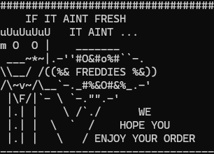
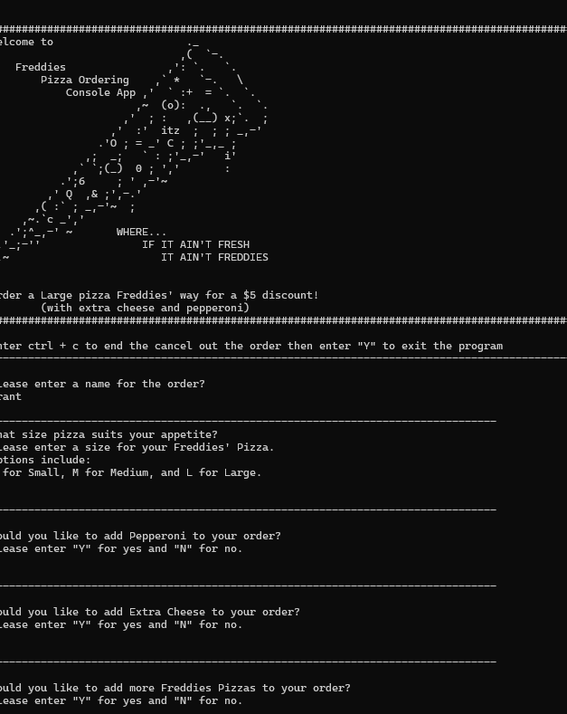
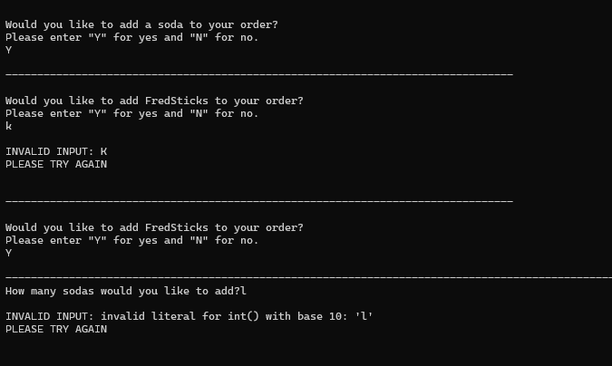
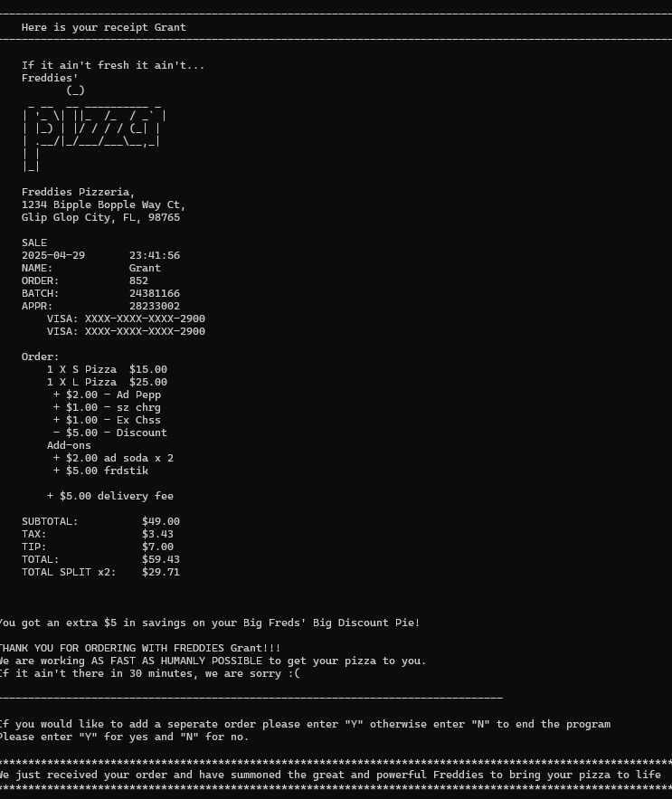
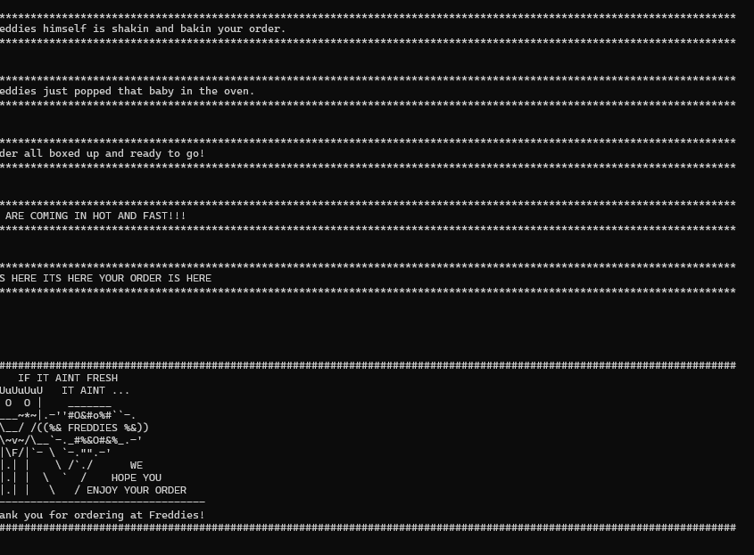

# Python Pizza Project

## Description
  
[https://github.com/Grantlw100/pythonPizzaProject](https://github.com/Grantlw100/pythonPizzaProject)
The final project for Programming Logic 1000-12345. This class project is the culmination of all learned  material and skill from throughout the course and tested through a final class project.

## **Table of Contents**
* [**I** Installation](#installation)
* [**II** Usage](#usage)
* [**III** Credits](#credits)
* [**IV** License](#license)
* [**V** Contributing](#contributing)
* [**VI** Tests](#tests)
* [**VII** Questions](#questions)


## **I** Installation
To install this project, begin by creating a new directory in a proper location on your computer. Change from your current directory into the new directory. You will need to [log into your github account via the console](https://docs.github.com/en/get-started/git-basics/set-up-git) then, simply follow these instructions created by Github.

```bash 
git init
git commit -m "first commit"
git branch -M main
git remote add origin https://github.com/Grantlw100/pythonPizzaProject.git
git pull origin main
```

*Alternatively*, you can download the project as a zip file from the repository and extract it to your desired location using the command line with git:

```bash
git clone https://github.com/Grantlw100/pythonPizzaProject.git
```
Or by navigating to [the repo on Github](https://github.com/Grantlw100/pythonPizzaProject) and clicking the green "Code" button, then selecting "Download ZIP". Once downloaded, extract the files to your desired location.


## **II** Usage
To use this project, you will need to have Python 3.x installed on your computer. You can download Python from the official website: [Python.org](https://www.python.org/downloads/).

Navigate to the directories main folder. Use your command line to run, end, and test the project. The Main Directory contains all of the code responsible for building receipts, creating orders, and choosing the items within the order. The Utility Directory contains the input validation logic, Freddies logo messages, and any small blocks of code that seemed out of place in their original files for the Freddies Pizza Ordering Application.The Test Directory contains the test alternatives to the main input validators and source code for the week 5 and week 4 tests. 

### Directory Structure
```bash
PythonPizzaProject
├─────README.md
├─────freddies.py
├─────assets/
├─────main/
│       ├── order.py
│       └── receipt.py   # Possibly calls everything
├─────test/
│       ├── Week4Test.py
│       └── week5Test.py                      
├─────utils/                       
│       ├── allcode.py
│       ├── TestFunctions.py
│       └── Utils.py
…
```

Running any file in this project requires pythons module notation: `python -m fileName`. Be sure ***NOT*** to include the .py from the python file's name as this is unnecessary when utilizing the module notation.
To run the project, open a terminal or command prompt, navigate to the directory where the project is located, and run the following command:
```bash
python -m freddies
```

This will start the application and prompt the user for inputs. 

The initial prompt will be to query whether or not the user would like to perform tests. The query requests permission to run tests and the user will respond with `"Y"`and the number of tests to run or `"N"` to bypass tests.

Follow the prompts to place your order and subsequent orders.
The program will ask for a series of "Y" or "N" questions to build orders. Each subsequent order will be added into a final order where the user will be prompted to enter a tip as either a dollar amount or a percentage. The program will compile all pizzas for that order and print a receipt to the console followed by a series of delivery or pickup simulation messages. 


The end result should look like this: 





If you need to move the code into a simple python editor, use the `allcode.py` file and paste the code into your editor of choice. 


## **III** Credits
Franci Chappie  
Keyshla Taylor
Grant Williams  

## **IV** License
This project is licensed under the Apache 2.0 license.
https://opensource.org/licenses/Apache-2.0

## **V** Contributing
To contribute to this project, follow the [Installation](#installation) instructions, clone this repo and make changes to the repo. Submit your changes via a pull request where new features will be reviewed before being adding.
Ensure to include your name and all contributions in the `README.md` file.

## **VI** Tests
To test this application, run `python freddies.py` and follow the first initial prompts to run the tests. Tests are generated using randomly selected values from the list of options. The tests will run and print the results to the console.
There are two tests. One test is ran with nothing but proper inputs for each question. The second test is ran with random inputs for each question. The tests will print the results to the console. The program will then print the final order and receipt to the console and notify the user when the test session has ended. 

## **VII** Questions
If you have any questions, please feel free to reach out to me at Grant.L.Williams@outlook.com. You can also check out my GitHub profile at [GrantLw100, , ](GrantLw100, , ).
